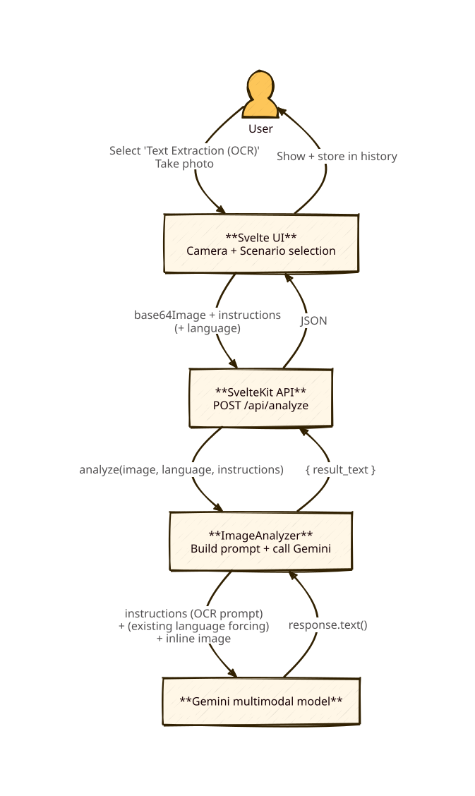

# Design: Add OCR-style text extraction as a new scenario (no backend changes)

## Diagram

## Context

- The app already supports multiple “scenarios” (predefined instructions) that are passed to `POST /api/analyze`.
- The backend (`ImageAnalyzer`) sends the prompt (including the scenario instructions) plus the image to Gemini and returns `{ result_text }`.

For the “book page / document photo” use case, users primarily want the *text that is visible in the image* so they can copy/paste it.

Constraints
- Least-change approach: reuse the existing flow and keep the backend/API unchanged.

## Goals / Non-Goals

**Goals:**
- Add a built-in scenario that makes the system behave like “OCR” by providing OCR-focused instructions.
- Keep the existing camera → analyze → history flow and endpoint unchanged.

**Non-Goals:**
- Perfect OCR accuracy and layout reconstruction.
- Guaranteeing non-translation / verbatim-only output (the backend currently applies a strong “answer language” instruction; we accept this for the minimal solution).
- Any new endpoints, request fields, or backend branching.

## Decisions

### Decision 1: Implement OCR as a new default scenario only
**Choice:** Add a new default scenario in `scenarioStore.ts`, e.g. id `text-extraction`, name “Text Extraction (OCR)”.

**Rationale:**
- Scenarios are the existing product concept for “different intents”.
- The least-change approach is to supply better instructions only.

**Alternatives considered:**
- Add an explicit `scenarioId`/mode to the API and branch backend prompting for OCR: more robust control, but not the least change.

### Decision 2: OCR instructions are “transcribe only” and suppress extra formatting
**Choice:** Scenario instructions will ask Gemini to:
- Return only the extracted text (no explanations, no summaries)
- Preserve line breaks/reading order best effort
- Avoid markdown/code fences

**Rationale:**
- Keeps results copy/paste friendly in the existing UI.

## Risks / Trade-offs

- **[Text may be translated/paraphrased]** → Mitigation: accept for v1 (user explicitly ok). If needed later, introduce a backend OCR mode that disables language forcing.
- **[Model may add commentary anyway]** → Mitigation: keep the scenario instructions very explicit (“Output ONLY the text”).
- **[Complex layouts (columns, headers/footers)]** → Mitigation: instruct best-effort reading order.
