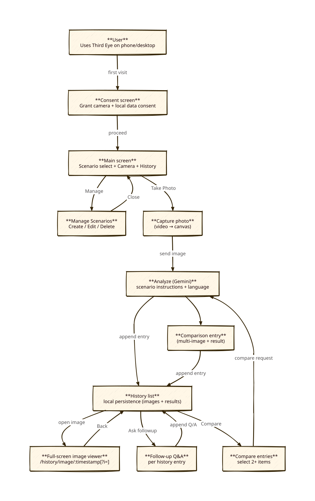
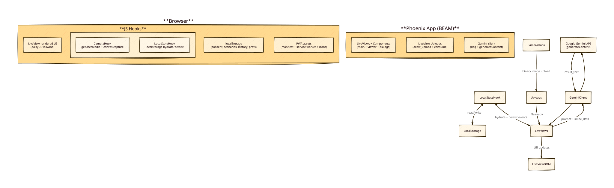

# Preserve Third Eye’s UX while modernizing the implementation

## Diagram

## Context

### Current app (SvelteKit)
Evidence (files):
- Main screen + scenario selection/manager toggle: `src/routes/+page.svelte`
- Core UI/flows live in a single, feature-rich component: `src/lib/components/Camera.svelte`
- Persistence is browser-local (`localStorage`) via Svelte stores: `src/lib/stores/*` (e.g. `analysisHistoryStore.ts`, `scenarioStore.ts`, `consentStore.ts`)
- Full-screen history image viewer route (client-side): `src/routes/history/image/[timestamp]/+page.svelte`
- Server endpoints:
  - analyze: `src/routes/api/analyze/+server.ts`
  - compare: `src/routes/api/compare/+server.ts`
- PWA shell (manifest/meta/service worker registration): `src/app.html`, `static/manifest.json`, `static/sw.js`

User-visible features we must keep (parity target):
- Consent gate before camera usage.
- Scenario dropdown with built-in scenarios + user CRUD (“Manage Scenarios”).
- Camera preview with camera-source switching (mobile toggle / desktop select).
- “Take Photo and Analyze” (captures and triggers analysis immediately), plus retake and re-analyze.
- Password input (gates API calls) and language selector.
- Analysis history stored in browser (images + result text), delete entry / delete all.
- Follow-up Q&A per history entry (chat history stored per entry).
- Compare multiple entries (creates a comparison entry with multiple images).
- Full-screen image viewer for history images.

### Reference LiveView stack already in use (sibling repos)
We already have proven patterns we want to copy rather than invent:
- Tailwind v4 + daisyUI via plugin directives in CSS (no JS/npm tailwind config):
  - `../agent-coding-gui/assets/css/app.css`
  - `../elix-live-chat/assets/css/app.css`
- JS hooks + localStorage patterns (robust “hydrate from local storage, then follow server updates”):
  - `../agent-coding-gui/assets/js/app.js`
- Gemini REST integration patterns (generateContent + `inline_data`) implemented with `Req`:
  - `../elix-live-chat/lib/live_ai_chat/ai_client.ex` (`inline_data: %{mime_type, data}`)

### LiveView best-practices evidence gathered
- Prefer LiveView uploads for binary data (avoid base64 bloat) using `allow_upload/3` + JS hook capture-to-`File`.
- Phoenix LiveView’s Hook API includes `upload(name, files)` (see `phoenix_live_view.js` ViewHook implementation in our deps), enabling programmatic upload of captured blobs.
- Persisting client preferences/state typically uses a JS hook that reads `localStorage` on mount and pushes a hydration event to the LiveView; server pushes events back when it wants the client to persist updates.

## Goals / Non-Goals

**Goals:**
- Keep user-facing behavior stable (flows, screens, interactions). Styling may shift to daisyUI.
- Rebuild on Phoenix LiveView (Elixir/BEAM), following our established patterns from `agent-coding-gui` and `elix-live-chat`.
- Use LiveView uploads for camera images (binary streaming) and avoid pushing large base64 payloads through normal LiveView event messages.
- Keep local persistence semantics: scenarios, preferences, and analysis history remain stored in the browser (local storage), with LiveView hydrated from it.
- Preserve the existing “parity surface” for each feature (consent, scenarios, capture/analyze, history, followups, compare, viewer, PWA shell).

**Non-Goals:**
- Introducing new user-facing features (beyond minor styling changes).
- Migrating history/scenarios to a server database (would change privacy/expectations and add complexity).
- Adding user accounts/auth (beyond the existing password gate).
- Perfect pixel-level visual matching (daisyUI will change visual styling).

## Decisions

### Decision 1: Build a new Phoenix LiveView app in parallel (don’t delete SvelteKit until parity)
**Chosen:** Add a Phoenix app alongside the existing SvelteKit implementation first, and only cut over once parity is demonstrated.

**Rationale:**
- Reduces risk: we can compare behaviors side-by-side.
- Keeps a working reference implementation for tricky UX details (camera switching, history viewer, compare dialog).

**Alternatives considered:**
- “Big bang” rewrite replacing the current app immediately (higher regression risk).

### Decision 2: Use JS hooks for camera (getUserMedia) + LiveView upload for transferring captured images
**Chosen:**
- A `CameraHook` owns `getUserMedia`, camera enumeration/switching, and capture to `<canvas>`.
- On capture, hook converts the canvas frame to a `Blob`, wraps it as a `File`, and calls `this.upload("capture", [file])` to send it through LiveView’s upload pipeline.

**Rationale:**
- Camera access is inherently browser-side; hooks are the LiveView-native interop point.
- LiveView uploads avoid base64 size inflation and WebSocket payload limits.

**Alternatives considered:**
- Sending base64 strings via `pushEvent` (simple but risks payload limits and poor perf).
- Posting to a separate JSON endpoint with multipart upload (works, but duplicates LiveView’s upload stack).

### Decision 3: Hydrate LiveView state from localStorage and keep localStorage as the persistence layer
**Chosen:** A `LocalStateHook` will:
- On mount: read localStorage keys (consent, scenarios, selectedScenarioId, custom instructions, history, password, language) and push a single “hydrate” event to LiveView.
- On server-driven updates: handle `push_event` messages from LiveView to update localStorage.

**Rationale:**
- Preserves the existing privacy/storage behavior.
- Avoids introducing a DB or account system.

**Alternatives considered:**
- Server-only state + DB persistence (changes semantics and adds ops burden).

### Decision 4: Keep routing semantics, but implement screens as LiveViews
**Chosen:**
- `/` main LiveView (consent gate, scenario selection, camera capture, history list).
- `/history/image/:timestamp` viewer LiveView (plus optional `?i=` for comparison index), mirroring current SvelteKit route shape.

**Rationale:**
- Preserves shareable URLs and native back behavior.
- Keeps the “full-screen viewer” as a first-class screen.

### Decision 5: Implement Gemini “vision” calls in Elixir via Req + generateContent
**Chosen:** Create a small, app-local Gemini client module modeled after `LiveAiChat.AIClient`:
- Use `generateContent` endpoint.
- Use `inline_data` parts for images (`mime_type` + base64 data).
- Keep prompt structure compatible with current instructions (scenario instructions + language directive + followup/comparison prompt variants).

**Rationale:**
- Reuses known-good patterns from our existing Elixir code.
- Keeps the AI integration BEAM-native and testable.

## Risks / Trade-offs

- **[Risk] LiveView diffs become large if we render base64 images directly from assigns** → **Mitigation:** keep uploads binary; downscale/encode to WebP on the client; if needed, store only image keys in assigns and render thumbnails via JS/localStorage.
- **[Risk] PWA service worker caching can interfere with LiveView CSRF tokens / websocket reconnect** → **Mitigation:** keep SW caching conservative (assets-only), and validate reconnect behavior early.
- **[Risk] Camera behavior differs across iOS/Android/desktop** → **Mitigation:** replicate current camera-selection heuristics; test on mobile early; keep hook logic isolated.
- **[Trade-off] LiveView requires some JS anyway (camera + localStorage)** → **Mitigation:** keep JS limited to hooks; all UI logic remains in LiveView/components.

## Migration Plan

### Phase 1 — Understand and document current UX (parity baseline)
- Create a “parity checklist” directly from the current SvelteKit implementation (features + edge cases).
- Document the user flows and UI states (consent → capture → analysis → history → viewer; scenario manager; followup; compare).
- Decide on deployment target for the new Phoenix app (local, server, packaged binary) so we can verify PWA behavior realistically.

### Phase 2 — Implement on LiveView stack
- Scaffold Phoenix app with Tailwind v4 + daisyUI configured like `agent-coding-gui`.
- Implement LiveViews + components in the same UX structure as today.
- Implement JS hooks (camera + localStorage hydration/persistence).
- Implement Gemini client and wire analyze/followup/compare.
- Verify each capability against the parity checklist; only then cut over.

## Open Questions

- Deployment target: do we want to keep a public hosted version (Cloudflare replacement), or is “run locally + open on phone” (like other BEAM tools) acceptable?
- Do we want to keep analysis history purely client-side (as today), or allow optional server-side persistence as a later enhancement?
- Should the password gate remain “send password on every request”, or should we verify once and store an authenticated session flag (same UI, better internals)?
