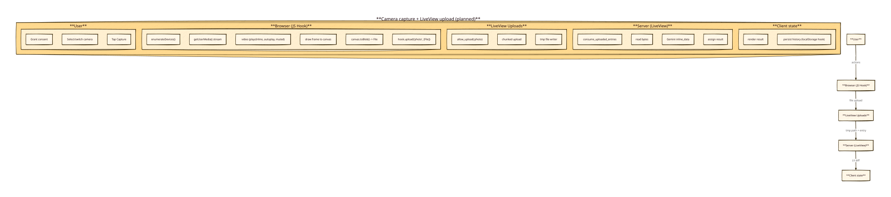

# Knowledge — camera hook + LiveView uploads

## Status / key takeaways

- **Camera parity baseline (legacy SvelteKit):** `src/lib/components/Camera.svelte` enumerates cameras, picks a default (mobile prefers “environment/back”), supports switching, sets `playsinline`, captures to `<canvas>`, then currently sends **base64** to `/api/analyze`.
- **iOS compatibility evidence (sibling repo):** `../agent-coding-gui/priv/static/live-api-client.js` explicitly sets:
  - `videoElement.muted = true`, `autoplay = true`, `playsInline = true` (comment: “Important for iOS”) and then calls `await videoElement.play()`.
  - It uses `facingMode: 'user' | 'environment'` and restarts the stream on toggle.
- **LiveView programmatic upload exists (direct evidence):** `ViewHook.upload(name, files)` calls `dispatchUploads(..., name, files)`.
  - Source: `../agent-coding-gui/deps/phoenix_live_view/priv/static/phoenix_live_view.js`.
- **LiveView upload config supports `:auto_upload` (direct evidence):** `UploadConfig` reads `Keyword.get(opts, :auto_upload, false)`.
  - Source: `../agent-coding-gui/deps/phoenix_live_view/lib/phoenix_live_view/upload_config.ex`.

## Diagram

## Legacy camera behavior we should keep (UX parity)

From `src/lib/components/Camera.svelte`:

- Enumerate cameras via `navigator.mediaDevices.enumerateDevices()`.
- Default selection rules:
  - **Mobile:** prefer camera labels containing back/rear/environment.
  - **Desktop:** prefer “FaceTime” / “Built-in” (avoid OBS virtual cam if possible).
- `getUserMedia` constraints:
  - If `selectedCameraId`: use `deviceId: { exact: ... }`.
  - Else fallback to `facingMode: 'environment'`.
  - Use `width/height: { ideal: IMAGE_WIDTH/IMAGE_HEIGHT }`.
- Enable capture button only after `loadeddata` event.
- `stopCamera()` stops tracks and clears `video.srcObject`.
- Capture uses canvas size `video.videoWidth/video.videoHeight` and `drawImage(video, 0, 0)`.

## Proposed LiveView approach (minimal, reliable)

### Why not base64 events
- Base64 inflates payload size and would go through the LV socket/event channel.
- We should use LiveView’s upload pipeline instead (already confirmed workable).

### JS hook capture responsibilities
- Start/stop camera stream.
- Maintain camera device list + current device id.
- Capture current frame to a `Blob` via `canvas.toBlob(...)`.
- Wrap into a `File` (e.g. `photo_<ts>.jpg`) and call `this.upload("photo", [file])`.

iOS-relevant settings (sibling evidence):
- Set video element properties:
  - `muted = true`, `autoplay = true`, `playsInline = true`
  - then call `video.play()` and surface errors.

### LiveView upload configuration
- Use `allow_upload(:photo, accept: ~w(.jpg .jpeg .png), max_entries: 1, max_file_size: ...)`.
- Optionally: `auto_upload: true` (supported per LV source).

### Server-side processing
- `consume_uploaded_entries(socket, :photo, fn %{path: path}, entry -> ... end)`
- Read file content (tmp file) and pass bytes to Gemini client (`inline_data`).

## Known uncertainties / items to verify during implementation

- **Does Safari require user gesture before `getUserMedia`/`play()`?**
  - Legacy app currently starts camera on mount after consent; it works “well enough” today.
  - We will keep the same UX, but be prepared to gate `start()` behind a user click if a device blocks autoplay.
- **Image size limits:** we should pick conservative `max_file_size` and potentially downscale/compress client-side if needed.

## Evidence pointers

- Legacy camera impl: `src/lib/components/Camera.svelte`.
- iOS video settings & facingMode toggling:
  - `../agent-coding-gui/priv/static/live-api-client.js` around the `playsInline = true` line.
- LiveView hook upload API:
  - `../agent-coding-gui/deps/phoenix_live_view/priv/static/phoenix_live_view.js` (`upload(name, files)`).
- LiveView upload config supports `:auto_upload`:
  - `../agent-coding-gui/deps/phoenix_live_view/lib/phoenix_live_view/upload_config.ex`.
