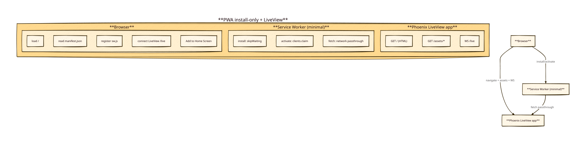

# Knowledge — PWA shell + minimal service worker (LiveView)

## Status / key takeaways

- Current SvelteKit app already has the core PWA metadata:
  - `static/manifest.json`: `start_url: "/"`, `display: "standalone"`, and 192/512 icons.
- Current SW (`static/sw.js`) is *slightly beyond install-only*:
  - it caches `/` + manifest + icons and does cache-first for assets + network-first for navigations.
  - this implies some limited offline shell fallback.
- For the LiveView rewrite, user preference is **install-only**. So we should default to **no caching** unless proven necessary for install prompt on target devices.

## Diagram

## Minimal SW strategy that should not interfere with LiveView

### Goal
- Keep PWA installability.
- Avoid offline complexity.
- Avoid breaking LiveView websocket path (`/live`).

### Conservative approach
- Register SW, implement only:
  - `install` → `skipWaiting()`
  - `activate` → `clients.claim()`
  - `fetch` → `respondWith(fetch(request))` (no caches)

Rationale:
- If some browsers require a `fetch` handler for install heuristics, this provides one.
- Because we do *no caching*, we minimize risk of stale assets.
- Even if the SW sees the initial `/live` handshake request, passing through to `fetch()` should not change behavior.

### What we will drop vs current app
- Drop cache storage (`caches.open/addAll`, `caches.match`, cache versioning).
- Drop “offline fallback” behavior.

## Reuse policy for migration

When implementing the PWA task in the new repo:
- Copy `static/manifest.json` and icons **verbatim** first (as parity baseline).
- Then decide SW:
  - Prefer minimal pass-through SW (above), unless install prompts regress.

## Evidence pointers

- Manifest: `static/manifest.json`
- Legacy SW: `static/sw.js`
