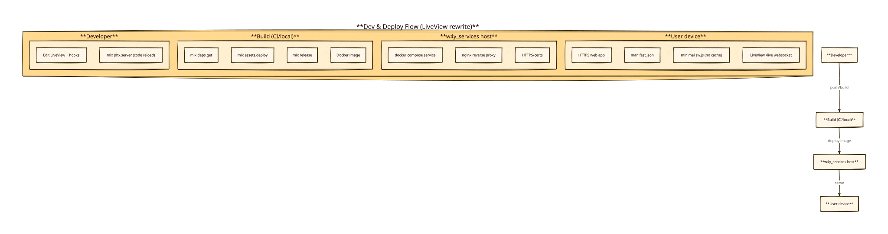

# Knowledge base — migrate-third-eye-to-liveview

## Status / key takeaways

- **Phoenix app scaffold (minimal deps + standard structure):** prefer `mix phx.new third_eye --live --no-ecto --no-mailer --no-gettext --no-dashboard`.
  - Note: local `mix phx.new` option list (2026-03-08) exposes `--[no-]esbuild` and `--[no-]tailwind` (no `--assets=...` / `--css=...` style flags).
  - `asks.sh` suggested `--assets=esbuild --css=tailwind`, but we should treat that as *potentially outdated* and follow the generator’s actual supported flags when we scaffold.
- **Dev auto-reload:** comes from Phoenix’s standard dev configuration (`Phoenix.CodeReloader` + `phoenix_live_reload`), so we should keep the default generated dev stack.
- **Runtime webserver pattern in sibling repos:** both `../elix-live-chat` and `../agent-coding-gui` run with **Bandit** and standard Phoenix releases.
- **PWA shell:** we only need “installable/startable”; offline caching is **not required**. A minimal SW should avoid interfering with LiveView’s socket path (`/live`).
- **Deployment:** follow `../w4y_services` + Docker image pattern used by `../elix-live-chat` (multi-stage build + `mix assets.deploy` + `mix release`).

## Diagram



## Phoenix scaffold: minimal dependencies, but standard Phoenix structure

Recommended generator invocation (aligned with the local `mix phx.new` option list observed on 2026-03-08):

```bash
mix phx.new third_eye \
  --live \
  --no-ecto --no-mailer --no-gettext --no-dashboard
```

Notes:
- Phoenix’s generator already supports toggling asset tooling via `--[no-]esbuild` and `--[no-]tailwind`.
- In this repo environment, `mix phx.new` itself is **not currently installed** (it printed the supported flags but failed to invoke the task). During execution we will likely need to install `phx_new` via `mix archive.install hex phx_new` before generating the app.

Rationale:
- **No Ecto**: current Third Eye persistence is explicitly *browser-local* (`localStorage`), so no DB layer.
- **No mailer / gettext / dashboard**: reduces deps + boilerplate; UI language in Third Eye is not gettext-based i18n.
- **esbuild + tailwind**: matches sibling repos’ asset toolchain and supports daisyUI.

Evidence (existing sibling repos):
- `../agent-coding-gui/mix.exs`: includes `{:phoenix, "~> 1.8.3"}`, `{:phoenix_live_view, "1.1.19"}`, `{:bandit, ...}`, `listeners: [Phoenix.CodeReloader]`, `{:esbuild, ...}`, `{:tailwind, ...}`.
- `../elix-live-chat/mix.exs`: similar toolchain; includes `{:bandit, "~> 1.5"}` and LiveView `~> 1.1.1`.

## Styling: Tailwind v4 + daisyUI (sibling repo pattern)

Reference: `../agent-coding-gui/assets/css/app.css`

Pattern:
- Tailwind is pulled via CSS: `@import "tailwindcss";`
- Content scanning is configured via `@source` directives pointing at `assets/js`, `assets/css`, and `lib/..._web`.
- daisyUI is integrated as a **Tailwind plugin** via vendored JS files under `assets/vendor/` and loaded using `@plugin "../vendor/daisyui"` / `@plugin "../vendor/daisyui-theme"`.

This is the style integration approach we should copy into the LiveView rewrite to maintain UI parity with minimal complexity.

## PWA shell knowledge (installable, no offline support)

### What we know / assume
- A **web app manifest** with correct icons + `display: "standalone"` is required.
- A **service worker** is commonly required for installability on Chromium-based browsers.

### What we could not verify yet
- **webs.sh is timing out** in this environment (headers timeout). We could not confirm latest (2025/2026) installability criteria via web search today.

### Conservative service worker stance (no caching)
If we include a SW at all, keep it minimal and **do not cache** by default. If later we add caching, we must explicitly exclude the LiveView socket path (`/live`).

Minimal SW shape (concept):
- `install`: `skipWaiting()`
- `activate`: `clients.claim()`
- `fetch`: `return fetch(request)` (no caches)

Legacy SvelteKit app baseline (for parity reference):
- `static/manifest.json`: `display: "standalone"`, `start_url: "/"`, icons 192/512.
- `static/sw.js`: caches only a small shell (`/`, manifest, icons) and does **network-first for navigations** with cache fallback.
  - This is still fairly conservative, but it *does* provide limited offline fallback for the shell. If we want “no offline” strictly, we can simplify further in the LiveView rewrite.

## Docker/release packaging pattern (sibling repo evidence)

Reference: `../elix-live-chat/Dockerfile`

Key practices worth reusing:
- **multi-stage build**
- build stage runs:
  - `mix deps.get --only=prod` + `mix deps.compile`
  - `mix compile`
  - `mix assets.setup` + `mix assets.deploy`
  - `mix release`
- runtime stage:
  - runs as non-root user
  - `PHX_SERVER=true`
  - expose `PORT` and healthcheck `GET /`

For Third Eye, we likely won’t need the extra PDF runtime deps that `elix-live-chat` installs.

## w4y_services deployment integration (sibling infra evidence)

Reference:
- `../w4y_services/README.md`
- Example service compose: `../w4y_services/services/know-ai.ai4you.app/know-ai.ai4you.app.yml`

Observations:
- Services attach to an external Docker network: `proxy-network`.
- Nginx reverse proxy + automatic HTTPS/cert flow is handled by `w4y_services`.
- Phoenix container commonly runs with `PORT=80` in the compose example.

## LiveView JS hooks + uploads + local state

Additional deep dives (persisted as separate knowledge docs):
- `./knowledge-camera-uploads.md`
- `./knowledge-pwa-service-worker.md`

Confirmed earlier during investigation:
- Phoenix LiveView JS hook supports programmatic upload: `ViewHook.upload(name, files)`
  - Evidence: `../agent-coding-gui/deps/phoenix_live_view/priv/static/phoenix_live_view.js` (hook API).

Planned patterns:
- **Camera hook** (`getUserMedia` + capture) produces a `File` (image) and uploads via LiveView upload.
- **LocalStorage hook** hydrates + persists user preferences/history/scenarios.

## Open items (not blocking implementation start)

- Re-try web validation of current PWA installability criteria when `webs.sh` is reliable again.
- Decide target hostname + service naming for `w4y_services`.
